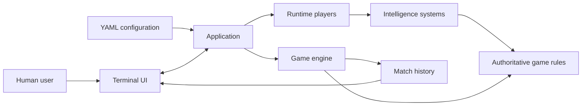
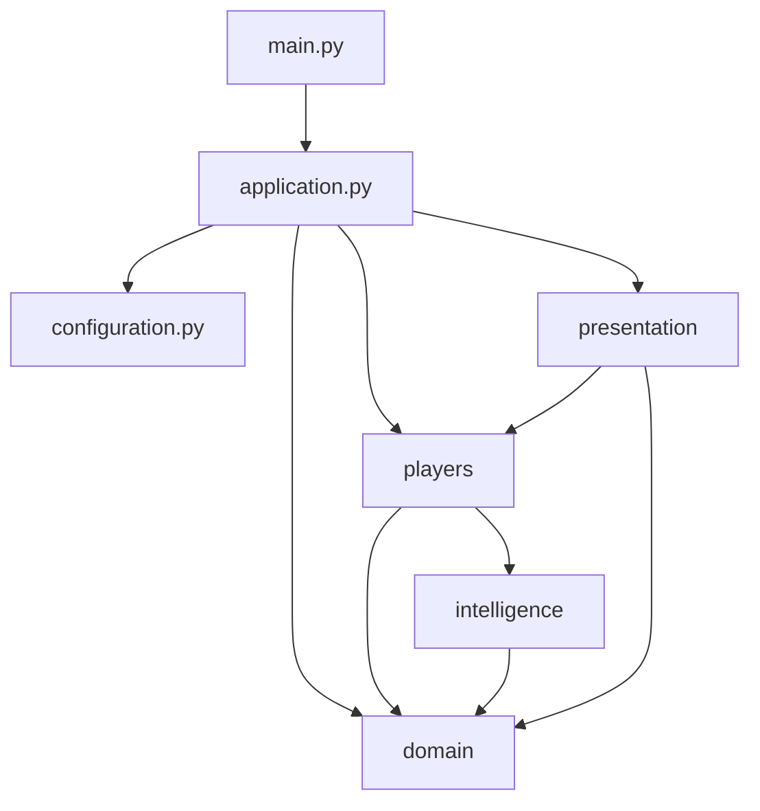
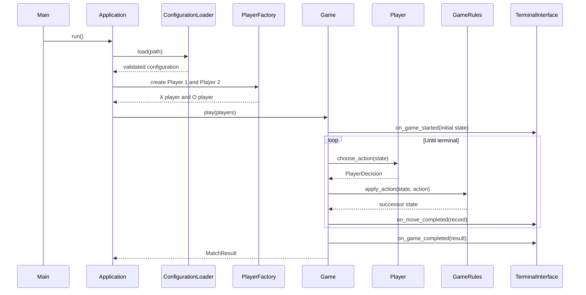

# Intelligence Equation Tic-Tac-Toe - Software Architecture

## 1. Purpose

This document defines the software architecture for the terminal Tic-tac-toe experiment.

The architecture separates:

- the mathematical game model;
- player identity and control;
- interchangeable computer intelligence;
- application coordination;
- configuration;
- terminal presentation.

The central design objective is to compare intelligence systems under identical game rules and execution
conditions. No strategy may own a private version of the Tic-tac-toe transition rules.

## 2. Architectural Principles

1. **One authoritative domain model.** Live play, minimax search, and causal-entropy search use the same immutable
   state and transition functions.
2. **Dependency inversion for intelligence.** The game loop depends on an intelligence protocol, not concrete AI
   implementations.
3. **Separation of policy and mechanism.** Strategies choose actions; the game engine validates and applies them.
4. **Immutable search state.** Applying an action produces a successor state, preventing search from corrupting
   live play or replay history.
5. **Configuration as composition.** YAML chooses profiles and strategy implementations without introducing game
   logic into the configuration loader.
6. **Terminal I/O at the boundary.** Domain and strategy modules do not print or read input.
7. **Controlled randomness.** Randomness is supplied through one injected dependency, seeded when configured and
   system-randomized otherwise.
8. **Small, explicit interfaces.** Classes have one primary responsibility and communicate through typed value
   objects.

## 3. System Context



The `Application` is the composition root. It loads configuration, constructs players and strategies, runs one
match, and asks the terminal presentation layer to display progress and replay.

## 4. Proposed Project Layout

```text
source/
├── main.py
├── application.py
├── configuration.py
├── errors.py
├── config/
│   └── example.yaml
├── domain/
│   ├── __init__.py
│   ├── action.py
│   ├── board.py
│   ├── game.py
│   ├── game_rules.py
│   ├── game_state.py
│   ├── history.py
│   ├── mark.py
│   └── outcome.py
├── players/
│   ├── __init__.py
│   ├── computer_player.py
│   ├── human_player.py
│   ├── player.py
│   ├── player_factory.py
│   └── player_profile.py
├── intelligence/
│   ├── __init__.py
│   ├── causal_entropy_strategy.py
│   ├── intelligence_strategy.py
│   ├── minimax_strategy.py
│   ├── random_strategy.py
│   ├── strategy_factory.py
│   └── tactical_strategy.py
├── presentation/
│   ├── __init__.py
│   ├── board_renderer.py
│   ├── replay_renderer.py
│   └── terminal_interface.py
├── docs/
│   ├── architecture.md
│   ├── formal-definition-wissner-gross-intelligence-equation.md
│   ├── formal-mathematical-model-of-tic-tac-toe.md
│   └── spec.md
└── tests/
    ├── integration/
    └── unit/
```

`main.py` and `application.py` remain at the project root to satisfy the required entry-point structure. Internal
modules are grouped by responsibility.

## 5. Dependency Rules



The following dependencies are prohibited:

- `domain` shall not import `players`, `intelligence`, `presentation`, or `configuration`.
- `intelligence` shall not import `presentation` or terminal I/O.
- `presentation` shall not import concrete intelligence strategies.
- concrete strategies shall not mutate `GameState`.
- configuration data classes shall not execute game behavior.

## 6. Mathematical Model Mapping

| Mathematical concept | Software representation |
|---|---|
| Cell domain $D = R \times C$ | `Action` coordinate value object |
| Mark set $\{X,O,\emptyset\}$ | `Mark` enumeration |
| Board function $b : D \to \Sigma$ | Immutable `Board` |
| Legal state $s \in S$ | Immutable `GameState` |
| Initial state $s_0$ | `GameState.initial()` |
| Legal actions $A(s)$ | `GameRules.legal_actions(state)` |
| Player to move $P(s)$ | `GameRules.player_to_move(state)` |
| Transition $T_g(s,a)$ | `GameRules.apply_action(state, action)` |
| Win predicate $W_m(s)$ | `GameRules.winning_lines(state, mark)` |
| Terminal predicate $Z(s)$ | `GameState.is_terminal` |
| Outcome $O(s)$ | `Outcome` value |
| Utility $U_i(s)$ | `GameRules.utility(state, mark)` |
| Strategy $\sigma_i$ | `IntelligenceStrategy.select_action()` |
| History $h$ | `GameHistory` and `MoveRecord` |
| Path set $\Gamma_\tau(s)$ | Causal-entropy path enumeration |
| Path entropy $S_\tau(s)$ | `CausalEntropyStrategy.path_entropy()` |

## 7. Domain Model

### 7.1 `Mark`

`Mark` is an enumeration containing:

- `EMPTY`;
- `X`;
- `O`.

It shall provide an opponent operation for `X` and `O`. Asking for the opponent of `EMPTY` shall fail explicitly.

### 7.2 `Action`

`Action` is an immutable coordinate value object:

| Field | Type | Constraint |
|---|---|---|
| `row` | Integer | 0 through 2 internally |
| `column` | Integer | 0 through 2 internally |

It shall convert to and from user notation such as `b2`. Parsing terminal text belongs at the presentation
boundary, while coordinate validation belongs to `Action`.

Canonical action order shall be row-major:

```text
a1, b1, c1, a2, b2, c2, a3, b3, c3
```

### 7.3 `Board`

`Board` is immutable and stores exactly nine `Mark` values, preferably as a tuple. It shall provide:

- cell access by `Action`;
- occupied and empty counts;
- a successor board with one mark placed;
- iteration in canonical order.

`Board` shall not decide whose turn it is or whether a move is legal in the current game state.

### 7.4 `Outcome`

`Outcome` is an immutable value containing:

| Field | Meaning |
|---|---|
| `status` | `ONGOING`, `DRAW`, or `WIN` |
| `winner` | Winning `Mark`, or absent |
| `winning_lines` | Zero or more completed winning lines |

Storing all winning lines supports the rare case in which one final move completes two lines and allows the
renderer to highlight every winning cell.

### 7.5 `GameState`

`GameState` is immutable and contains:

- `board`;
- `move_number`;
- `outcome`.

The player to move is derived from mark counts and is not independently mutable. A state constructor shall be
restricted or validated so that corrupt board/count combinations cannot enter normal execution.

Suggested query properties:

```python
state.is_terminal
```

Player-to-move calculation and legal actions remain operations of `GameRules` so there is only one rule
implementation.

### 7.6 `GameRules`

`GameRules` is a stateless domain service and the sole authority for:

- all eight winning lines;
- legal-action generation;
- player-to-move derivation;
- successor generation;
- outcome calculation;
- utility calculation;
- legal-state invariant checks.

Its essential operations are:

```python
class GameRules:

    def initial_state ( self ) -> GameState:
        ...

    def legal_actions ( self, state: GameState ) -> tuple [ Action, ... ]:
        ...

    def apply_action ( self, state: GameState, action: Action ) -> GameState:
        ...

    def utility ( self, state: GameState, perspective: Mark ) -> int:
        ...
```

`apply_action()` shall reject terminal states and illegal actions. Search strategies shall call this operation
rather than reproducing transition logic.

### 7.7 `GameHistory`

`GameHistory` stores ordered immutable `MoveRecord` values:

| Field | Meaning |
|---|---|
| `move_number` | One-based accepted move number |
| `player_profile_id` | Source profile identifier |
| `player_name` | Display name at the time of play |
| `player_type` | Human or computer |
| `mark` | `X` or `O` |
| `action` | Selected cell |
| `state_after` | Immutable successor state |
| `decision` | Optional computer decision diagnostics |

The history shall never include rejected input. The replay renderer shall consume `state_after` snapshots.

## 8. Player Model

### 8.1 `PlayerProfile`

Configuration is converted into validated immutable profile objects:

```python
@dataclass ( frozen = True )
class PlayerProfile:

    profile_id:              str
    name:                    str
    player_type:             PlayerType
    intelligence_type:       str | None
    intelligence_parameters: Mapping [ str, object ]
```

Human profiles have no intelligence settings. Computer profiles require them.

### 8.2 `Player`

`Player` represents a runtime participant assigned to a mark:

```python
class Player ( Protocol ):

    profile: PlayerProfile
    mark:    Mark

    def choose_action ( self, state: GameState ) -> PlayerDecision:
        ...
```

`PlayerDecision` contains the selected action and optional diagnostics.

### 8.3 `HumanPlayer`

`HumanPlayer` delegates input to a terminal input port. It repeatedly requests input until a legal action is
returned or input ends. It receives the shared `GameRules` service for legality checks but does not apply the
move.

### 8.4 `ComputerPlayer`

`ComputerPlayer` owns one `IntelligenceStrategy` and delegates action selection to it. The computer player adds
identity information to the returned strategy decision but does not evaluate the board itself. It supplies the
strategy with the current legal-action tuple obtained from `GameRules`.

### 8.5 `PlayerFactory`

`PlayerFactory` creates independent runtime players for the two match slots. It resolves human input dependencies
and asks `StrategyFactory` for computer strategies.

## 9. Intelligence Architecture

### 9.1 Strategy Contract

All strategies implement one protocol:

```python
class IntelligenceStrategy ( Protocol ):

    @property
    def name ( self ) -> str:
        ...

    def select_action (
        self,
        state: GameState,
        acting_mark: Mark,
        legal_actions: tuple [ Action, ... ],
        random_generator: random.Random,
    ) -> StrategyDecision:
        ...
```

`StrategyDecision` contains:

- selected `Action`;
- candidate `ActionScore` values when meaningful;
- strategy name;
- optional structured metadata such as search depth or evaluated-state count.

The contract requires:

- `state` is ongoing;
- `acting_mark` equals `GameRules.player_to_move(state)`;
- `legal_actions` equals `GameRules.legal_actions(state)`;
- the returned action belongs to `legal_actions`;
- the strategy does not mutate shared state.

Concrete strategy constructors receive the shared `GameRules` service so search implementations can generate and
apply future actions through the authoritative rules.

### 9.2 Strategy Registration

`StrategyFactory` maps configuration names to constructor functions:

```text
random         -> RandomStrategy
tactical       -> TacticalStrategy
minimax        -> MinimaxStrategy
causal_entropy -> CausalEntropyStrategy
```

Registration shall be centralized. Adding a new strategy requires:

1. an implementation of `IntelligenceStrategy`;
2. a parameter validator;
3. one factory registration;
4. strategy-specific tests.

No changes shall be required in `Game`, `Application`, player classes, or renderers.

### 9.3 Random Strategy

`RandomStrategy` chooses uniformly from the canonical legal-action tuple using the injected random generator.

### 9.4 Tactical Strategy

`TacticalStrategy` assigns a priority category to each legal successor:

1. immediate win;
2. immediate-loss prevention;
3. center;
4. corner;
5. edge.

It uses `GameRules.apply_action()` to test immediate wins and threats.

### 9.5 Minimax Strategy

`MinimaxStrategy` recursively evaluates every legal successor until terminal states. It maximizes utility on the
acting player's turns and minimizes it on the opponent's turns.

The memoization key shall include:

- immutable board encoding;
- player to move;
- root perspective.

Equivalent best moves are resolved only after minimax values are known.

### 9.6 Causal-Entropy Strategy

The causal-entropy strategy is a pure future-optionality policy.

For every legal candidate action:

1. Produce successor $s_a$ through `GameRules.apply_action()`.
2. Count admissible future histories from $s_a$ to the configured horizon.
3. Compute $S_\tau(s_a) = \log |\Gamma_\tau(s_a)|$.
4. Optionally compute the explicit difference:

   $$
   C(s,a) = T[S_\tau(s_a) - S_\tau(s)]
   $$

5. Choose an action with maximal score.

The current-state entropy needs to be evaluated only once per decision. Because it is common to all candidates,
an optimized implementation may select by successor entropy while still reporting the explicit difference.

#### 9.6.1 Path Counting

Define:

$$
N(s,d)
=
\begin{cases}
1, & \text{if } d=0 \text{ or } s \text{ is terminal}, \\
\sum\limits_{a \in A(s)} N(T_g(s,a),d-1), & \text{otherwise}.
\end{cases}
$$

Then:

$$
S_d(s) = \log N(s,d)
$$

This recurrence gives every terminal trajectory one completed-path count and includes all legal choices by both
future players.

The implementation shall memoize `N(state, remaining_depth)`. A suitable key is:

```text
(board_tuple, remaining_depth)
```

The player to move is derivable from a legal board and need not be duplicated in the key.

#### 9.6.2 Numerical Behavior

- Counts shall use Python integers.
- Entropy shall use the natural logarithm.
- Scores equal within a small explicit tolerance shall be treated as ties.
- Temperature shall be finite and greater than zero.
- No terminal utility shall be added to the score.

#### 9.6.3 Why Utility Is Excluded

Adding a win reward or loss penalty would turn the policy into a hybrid objective and confound the experiment.
The pure implementation makes it possible to observe whether maximizing future path entropy independently produces
competitive play.

## 10. Game Orchestration

### 10.1 `Game`

`Game` coordinates one match:

```python
class Game:

    def play ( self, player_x: Player, player_o: Player ) -> MatchResult:
        ...
```

Its loop is:

1. Create the initial state.
2. Publish the initial state for rendering.
3. Determine the current player from the state.
4. Request a `PlayerDecision`.
5. Validate the selected action.
6. Apply it through `GameRules`.
7. Append a `MoveRecord`.
8. Publish the move and successor state.
9. Repeat until terminal.
10. Return `MatchResult`.

`Game` shall not know whether a player is human or computer beyond information needed for presentation events.

### 10.2 `MatchResult`

`MatchResult` contains:

- Player 1 and Player 2;
- final state;
- outcome;
- complete history;
- winner, when present.

It is the input to result and replay rendering.

### 10.3 Event Boundary

The game may report progress through a small observer or callback interface:

```python
class GameObserver ( Protocol ):

    def on_game_started ( self, state: GameState, players: tuple [ Player, Player ] ) -> None:
        ...

    def on_move_completed ( self, record: MoveRecord ) -> None:
        ...

    def on_game_completed ( self, result: MatchResult ) -> None:
        ...
```

This keeps terminal formatting out of the game engine and allows a future batch runner to use a non-terminal
observer.

## 11. Configuration Architecture

### 11.1 `ConfigurationLoader`

`ConfigurationLoader` is responsible for:

- reading UTF-8 YAML;
- safe YAML parsing;
- rejecting unknown fields;
- validating required types and ranges;
- resolving selected profile identifiers;
- producing typed immutable configuration objects.

It shall use `yaml.safe_load()` or an equivalent safe parser.

### 11.2 Typed Configuration

Suggested value objects:

```text
ApplicationConfiguration
PlayerProfile
IntelligenceConfiguration
MatchConfiguration
PresentationConfiguration
```

Strategy-specific parameter validation belongs to the strategy registration/factory layer, because only the
strategy knows its valid parameter schema.

### 11.3 Error Aggregation

Independent configuration errors should be collected and reported together. For example, an unknown strategy and
a missing match profile should appear in one validation report rather than requiring repeated executions.

## 12. Presentation Architecture

### 12.1 `TerminalInterface`

`TerminalInterface` owns:

- user prompts;
- input reading;
- match header output;
- error and result messages;
- coordination of board and replay renderers.

It shall depend on an input stream and output stream supplied by `Application`, enabling tests with in-memory
streams.

### 12.2 `BoardRenderer`

`BoardRenderer` is a pure formatter:

```python
def render ( state: GameState, include_coordinates: bool = True ) -> list [ str ]:
    ...
```

It shall:

- render one board at a stable width;
- highlight cells in `Outcome.winning_lines`;
- avoid terminal writes;
- return lines suitable for standalone or side-by-side display.

### 12.3 `ReplayRenderer`

`ReplayRenderer` receives the immutable move history. It renders each board to equal-width lines, chunks boards
into configured row groups, and horizontally joins corresponding lines with fixed spacing.

Captions are rendered above each board, with column labels underneath the board. This line-oriented composition
avoids special cases for the final short row.

### 12.4 Computer Diagnostics

Strategy diagnostics remain structured until presentation. The terminal layer may display:

| Action | Score | Selected |
|---|---:|---|
| `a1` | 3.178054 | |
| `b2` | 3.583519 | Yes |

The domain and strategy layers shall not format diagnostic tables.

## 13. Application Lifecycle

### 13.1 `main.py`

`main.py` shall remain minimal:

```python
from application import Application


if __name__ == '__main__':
    Application ().run ()
```

The exact formatting will follow project coding standards, but no composition logic belongs in this file.

### 13.2 `Application`

The application entry-point contract is:

```python
class Application:

    def run ( self ) -> None:
        ...
```

`Application.run()` performs:

1. Parse the command line.
2. Load and validate YAML configuration.
3. Create the configured or system-randomized random generator.
4. Construct shared `GameRules`.
5. Construct terminal presentation services.
6. Construct Player 1 as `X`.
7. Construct Player 2 as `O`.
8. Construct and execute `Game`.
9. Receive the `MatchResult`; the terminal observer renders the result and replay on game completion.
10. Convert expected application exceptions into concise terminal diagnostics and exit status.



## 14. Error Model

Expected errors shall use application-specific exception types:

| Exception | Meaning |
|---|---|
| `ConfigurationError` | YAML could not be read, parsed, or validated |
| `CoordinateError` | Human coordinate text is malformed |
| `IllegalActionError` | Action is outside the legal action set |
| `TerminalStateError` | Transition requested from a terminal state |
| `StrategyContractError` | A strategy violated its action-selection contract |
| `InputEndedError` | Human input ended before the match completed |

Recoverable human coordinate and occupied-cell errors are handled inside the human-turn interaction. Configuration
and contract errors terminate the application cleanly.

## 15. Test Architecture

### 15.1 Domain Unit Tests

- Empty initial board and Player `X` to move.
- Legal action generation for representative states.
- Every row, column, and diagonal win.
- Dual-line win produced by one move.
- Full-board draw.
- Turn-count invariants.
- Rejection of occupied cells and terminal-state transitions.
- Utility from both player perspectives.

### 15.2 Strategy Unit Tests

- Random strategy always returns a legal action and is seed-reproducible.
- Tactical strategy wins immediately when possible.
- Tactical strategy blocks an immediate loss.
- Minimax selects only optimal-value actions.
- Minimax versus minimax has initial value zero and ends in a draw.
- Causal path counts match hand-calculated shallow trees.
- Terminal causal path count is one.
- Causal entropy uses natural logarithms and configured horizon.
- Causal entropy contains no terminal utility adjustment.
- Tie-breakers obey canonical order or seeded randomness.

### 15.3 Configuration Tests

- Valid human and computer profiles.
- Unknown fields.
- Missing selected profiles.
- Unknown strategy names.
- Invalid entropy horizon and temperature.
- Same-profile computer self-play.

### 15.4 Presentation Tests

Golden-output tests shall cover:

- empty board;
- ordinary board;
- one winning line;
- two winning lines;
- move captions;
- replay rows of four and a partial final row;
- human and computer result messages.

### 15.5 Integration Tests

- Human versus human using scripted input.
- Human versus each computer strategy.
- Computer versus computer without input.
- Invalid input followed by a legal move.
- Complete seeded match output.
- Configuration failure before game construction.

## 16. Extension Points

The architecture intentionally supports:

- new strategies such as Monte Carlo, alpha-beta, entropy-plus-utility, or learned policies;
- alternative path probability models for causal entropy;
- tournament and repeated-match runners;
- structured JSON or CSV experiment logs;
- other finite turn-based games that implement a compatible game-rules protocol;
- graphical presentation adapters.

These extensions shall preserve the initial `causal_entropy` definition so experimental results remain comparable.

## 17. Key Architecture Decisions

| Decision | Rationale |
|---|---|
| Immutable board and state | Safe search, replay snapshots, hashable memoization keys |
| One `GameRules` service | Prevents rule drift between live play and strategies |
| Strategy protocol plus factory | Enables YAML-selected interchangeable intelligence |
| Pure causal entropy without utility | Preserves the experiment's independent variable |
| Injected randomness with optional seed | Reproducible comparisons when seeded; fresh play when unseeded |
| Observer-style presentation boundary | Keeps terminal output out of the game engine |
| Typed validated configuration | Fails early and keeps YAML concerns outside the domain |
| Full history snapshots | Reliable side-by-side replay without state reconstruction |
